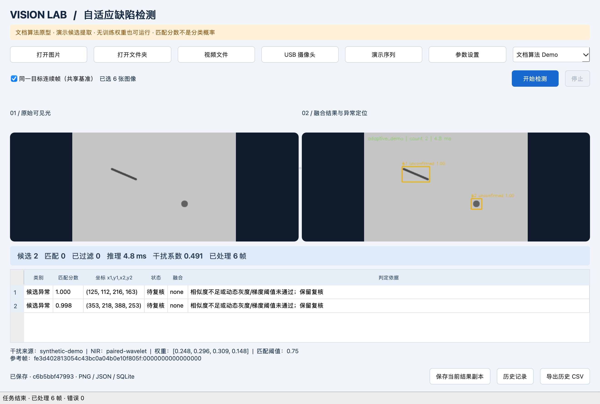

# 基于机器视觉的缺陷检测系统

面向动态灰度漂移场景的多帧缺陷匹配与融合桌面原型。

本项目作为黑客松团队个人能力边界的辅助验证资料，用于展示软件原型、合成演示与已有验证记录。当前结果不代表真实工业检测精度或生产部署能力。

## 项目功能

- 单图、文件夹批量、同目标连续帧、USB摄像头、视频文件。
- 可选可见光/NIR配对与干扰JSON；缺失传感器数据时明确标注模拟来源。
- 二级小波融合、四类128维特征基因、动态阈值、动态权重余弦匹配。
- 低漂移均值融合、高漂移局部对齐与灰度校正融合、低相似候选过滤。
- 参考帧选择、未确认/跨帧匹配/已过滤三种状态及解释。
- PySide6双图界面、参数设置、结果表、后台线程、停止、历史预览。
- 自动保存原图/融合图/标注图/完整JSON/SQLite，导出CSV。
- 100帧基准灰度标定、100组干扰系数标定、受监督增量SGD工具。
- 独立Detector接口；可选本地YOLO适配器。



## 快速启动

首次使用请先按下方“安装”步骤创建虚拟环境并安装依赖。macOS / Linux 激活后运行：

```bash
source .venv/bin/activate
python main.py
```

界面点击 **演示序列 → 开始检测**。首先建立基准，随后显示匹配；最后几帧因灰度漂移超出动态阈值保留“待复核”，这是预期行为。每帧结果自动保存在 `data/output/`。

无需界面的演示：

```bash
python main.py --demo
```


## 环境要求

Python 3.10+，建议3.12；Windows/macOS/Linux桌面。随项目提供的历史验证记录环境：macOS arm64、Python 3.12.14。其他系统尚未实际测试。

GUI依赖使用官方 `PySide6-Essentials` 分发包，提供本程序使用的 `PySide6.QtCore/QtGui/QtWidgets/QtTest`；无需未使用的Qt附加模块。OpenCV使用headless分发，图像显示全部由Qt负责。不需要CUDA、PyTorch或YOLO权重启动默认模式。

## 安装

新机器请在本目录创建自己的虚拟环境，不要复制现有 `.venv`：

```bash
python3 -m venv .venv
source .venv/bin/activate
python -m pip install -r requirements.txt
python main.py
```

Windows激活命令：`.venv\Scripts\activate`。

`requirements.txt` 定义兼容版本范围；`requirements-lock.txt` 记录本次验证的精确依赖版本，可用 `pip install -r requirements-lock.txt` 复现。不同平台/Python版本应确认对应wheel可用。

## 使用说明

1. **单图**：打开图片后开始检测；无基准时输出候选，分数0，不假装完成跨帧确认。
2. **文件夹**：按文件名排序处理当前层图像。不同零件保持“同一目标连续帧”未勾选；同一目标的连续拍摄可勾选共享基准。
3. **摄像头/视频**：选择来源，再开始检测；实时推理在QThread中执行。USB设备权限由系统控制；停止和关闭窗口会安全结束当前帧后释放采集。
4. **参数设置**：调整候选阈值、最小面积、匹配/过滤阈值、k1/k、模拟干扰及USB索引。界面修改作用于当前会话；持久设置请编辑 `config/config.json`。运行中禁用输入与参数变更。
5. **模型选择**：默认文档算法Demo；真实模型需配置本地路径再切换。
6. **查看结果**：左原图、右融合图和标注，下方查看坐标、匹配分数、状态及依据。黄色为待复核，绿色为匹配；已过滤项仍在结果表和JSON中。
7. **保存与历史**：自动保存完整记录；“保存当前结果副本”另存标注图；历史窗口点击行预览；CSV导出全部历史（历史界面显示最近200帧）。

序列重新开始时重建运行基准；不同尺寸会清空参考缓存。持久的100帧标定基准如尺寸不匹配则明确报错。USB/视频将每个处理帧落盘，长期采集需规划存储容量和生产保留策略。

## 系统架构

```text
图片 / 配对NIR / USB / 视频 + 干扰包
             │
      FramePacket（时间与唯一绑定）
             │
   ┌─────────┴──────────┐
多谱去噪 / 候选 / 特征   干扰归一化 / 耦合系数
   │                        │
   └──── 动态权重匹配 ← 动态阈值
                  │
       分层融合 / 过滤 / 待复核
                  │
         DetectionResult
         ├─ Qt信号 → 界面
         └─ PNG / JSON / SQLite → CSV
                       │
               独立实测与人工标签
                       │
                标定 / SGD更新
```


## 项目目录

```text
main.py                 GUI、命令行Demo、GUI烟雾验证
app/                    窗口、后台Worker与图像控件
vision/                 数据对象、预处理、基因、匹配融合、采集、标定
models/                 Detector接口、文档算法Demo、可选YOLO
services/               检测编排、文件/数据库/CSV、受监督学习
utils/                  配置验证、项目路径
config/config.json      算法、模拟干扰、路径配置
scripts/                演示生成、基准标定、干扰标定与学习入口
tests/                  自动测试
data/input/             合成图片、NIR、旁车JSON、演示视频
data/output/            自动保存结果、日志、数据库（不纳入版本控制）
weights/                用户自行提供的真实模型
docs/analysis.md         原始需求、算法类别、缺失项与冲突
docs/architecture.md     系统设计
docs/data_contract.md    输入输出、标定和学习样本格式
docs/implementation_report.md  实现对照、验证证据、限制
```

本仓库提供演示程序、合成样例和使用说明。原始技术文档及绘图文件不随仓库分发。

## 模型配置

默认 `detector=adaptive_demo`，不读权重、不下载模型。更换训练模型有两种方式：

- 实现 `models/base.py` 的 `load_model/predict/reset` 契约，在 `services/detection.py` 的工厂选择中注册。
- 使用已有YOLO适配器：`python -m pip install -r requirements-yolo.txt`，把真实、可信的本地权重放到 `weights/best.pt`，设置 `model_path` 后在GUI选择“本地YOLO权重”，或在配置中设置 `detector=yolo`。

模型不存在时给出明确错误，不自动下载或把Demo冒充真实模型。YOLO是独立单帧检测模式，类别由权重提供，不等于文档的多帧融合流程；当前没有真实权重，尚未验证真实模型推理。

## 数据集配置

无需训练集即可运行合成演示。真实图片放在任意文件夹由GUI选择。配对名称为 `frame_000.png` / `frame_000_nir.png`，旁车为 `frame_000.json`。NIR必须预先完成几何配准；支持的干扰字段、完整JSON示例见 [数据契约](docs/data_contract.md)。

原文没有缺陷类别字典和标注数据，本项目不伪造语义分类标签。Demo仅对局部灰度异常提议候选，不适合直接部署在任意复杂工业背景。

## 摄像头配置

`camera_index`默认0。USB视频源使用OpenCV VideoCapture，不具备工业相机温度、光强、硬同步及真正NIR能力。工业扩展接口见 `vision/camera.py` 的 `IndustrialCamera`；在SDK适配器返回同步 `FramePacket` 后交给 `DetectionService.detect()`。工业以太网、分时曝光、500–900nm双谱、真实反光率反演均需实际硬件与标定，当前没有假实现。

## 标定与学习

```bash
# 至少100帧同一目标无干扰图片，生成均值基准
python -m scripts.build_baseline /path/to/baseline_frames data/input/baseline.npz
# 至少100组实测干扰与灰度漂移系数
python -m scripts.calibrate measurements.json
# 每满1000个新ID执行一次SGD；可含人工匹配标签
python -m scripts.calibrate feedback.json --incremental
```

配置 `baseline_path` 后启用100帧标定灰度；默认使用单参考帧均值并记录Demo状态。学习状态在配置的 `learning_state` 中保存，下一次检测加载；其中学习后的alpha、权重修正和匹配阈值优先于初始值。没有实测与人工反馈时不自动学习。删除或移走**自行生成的学习状态文件**可回到初始参数。

## 测试与验证

```bash
python -m ruff check app vision models services utils scripts tests main.py
python -m compileall -q app vision models services utils scripts tests main.py
QT_QPA_PLATFORM=offscreen python -m pytest -q
python main.py --demo
python main.py --gui-smoke --output data/output/gui_check
```

Windows无需前缀环境变量时可直接 `python -m pytest -q`（测试内部会设置offscreen）。GUI烟雾模式启动真实窗口，通过真实Worker完成6帧并截图退出。没有显示服务器时可使用 `QT_QPA_PLATFORM=offscreen` 运行烟雾模式，但这不证明原生桌面显示可用。

## 后续扩展

最优先收集带缺陷真值的同目标多帧VIS/NIR与同步干扰数据，完成几何/灰度/耦合标定，并用独立测试集测量误检、漏检和漂移鲁棒性。其次接入真实工业SDK和ROI配准算法；最后优化采集、推理与存储吞吐。不要以本次合成图上的毫秒耗时替代30fps生产系统验收。
